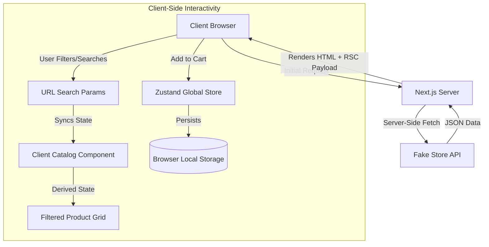

# Architecture Overview

## 1. System Design Paradigm
This application is built using the **Next.js 16 App Router**, leveraging a modern hybrid rendering approach. The core philosophy of this architecture is to ship as little JavaScript to the client as possible by keeping heavy lifting on the server, while still providing a highly interactive user experience where necessary.

### 1.1 Server vs. Client Components Split
- **Server Components (Default)**: Used for data fetching (`getProductsServer`), routing, layout structuring, and SEO optimization. By default, pages like the Home page and Product Detail page are rendered on the server.
- **Client Components (`"use client"`)**: Used strictly at the leaf nodes of the component tree. Interactive elements like the `ClientCatalog`, `Cart` buttons, filtering logic, and Zustand state consumers are explicitly marked as client components.

## 2. High-Level Architecture Diagram

## 3. Data Flow and State Management

### 3.1 Global State (Zustand)
We chose **Zustand** for managing the global shopping cart state over React Context or Redux. 
- **Why?** It avoids the need to wrap the application in a Context Provider (which forces the entire tree into a Client Component in the App Router), preventing unnecessary re-renders and maintaining a clean Server Component hierarchy at the top level.
- **Persistence**: The cart store uses Zustand's `persist` middleware, automatically saving the cart state to `localStorage`. This ensures users do not lose their cart items when navigating away or refreshing the page.

### 3.2 URL-Driven State (Filtering & Search)
Instead of keeping the active category, search query, and price range strictly in local React state (`useState`), we lift this state into the **URL Search Parameters** (`?category=...&search=...`).
- **Benefits**:
  - **Shareability**: Users can share a link with a pre-applied filter, and the recipient will see the exact same view.
  - **History**: Browser back/forward navigation works seamlessly with filter states.

## 4. UI & Component Architecture
The UI is constructed using **Tailwind CSS** and bespoke, custom-built components (e.g., custom Toasts, Buttons, Badges) rather than a heavy component library like Material-UI or Radix.
- **Modularity**: Components are broken down into logical units (`components/product/`, `components/cart/`).
- **Styling**: Tailwind enables rapid, utility-first styling while keeping the CSS bundle size strictly limited to the classes actually used in the project.
