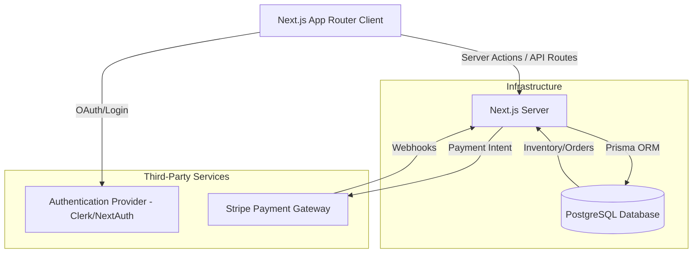

# Future Enhancements & Roadmap

This document outlines the strategic vision for evolving the Whatbytes E-Commerce application from a frontend prototype into a production-grade enterprise application.

## 1. Short-Term Enhancements (Immediate Technical Debt)

Before adding major new features, the following foundational improvements should be implemented:

- **Zustand Hydration Fix**: Implement a custom `useStore` hook or hydration check to prevent React hydration mismatches between the server-rendered HTML and the client-rendered `localStorage` cart state.
- **Environment Variables**: Move hardcoded API URLs (e.g., Fake Store API) to a `.env.local` file to support distinct staging and production environments.
- **Error Boundaries & Suspense**: Wrap critical Next.js layout sections in React Error Boundaries (`error.tsx`) to catch unexpected API failures gracefully, and utilize Suspense fallbacks more granularly for streaming UI updates.
- **Testing Integration**: 
  - Install **Jest** and **React Testing Library** for unit testing custom hooks (like `useFilteredProducts`) and UI components.
  - Implement **Playwright** or **Cypress** for critical end-to-end user flows (e.g., adding an item to the cart and verifying the subtotal).

## 2. Long-Term Vision (Feature Roadmap)

To scale the application, we need to transition away from the mock API and integrate real backend services.

### Phase 1: Authentication & User Profiles
- Integrate an auth provider like **NextAuth.js** or **Clerk**.
- Allow users to create accounts, save wishlists, and view order history.

### Phase 2: Database & Server-Side Filtering
- Replace the Fake Store API with a real database (e.g., PostgreSQL via Prisma or Supabase).
- Move filtering logic from the client to the server to support large catalogs with server-side pagination (offset/limit cursors).

### Phase 3: Checkout & Payments
- Build a secure checkout flow.
- Integrate **Stripe** or **Razorpay** for payment processing.

## 3. Future State Architecture

Below is a proposed architecture for the fully realized production application:

## 4. Quality Assurance (QA) Strategy

As the application grows, manual testing will become a bottleneck. The QA strategy must evolve to include:
- **CI/CD Pipelines**: Enforce automated testing (Jest/Playwright) on every GitHub Pull Request via GitHub Actions. Merges are blocked if test coverage drops or builds fail.
- **Visual Regression Testing**: Use tools like Percy or Chromatic to automatically detect unintended UI changes across different device breakpoints.
- **Accessibility (a11y) Audits**: Automate axe-core audits to ensure all UI elements (especially custom dropdowns and toasts) remain fully accessible to screen readers.
